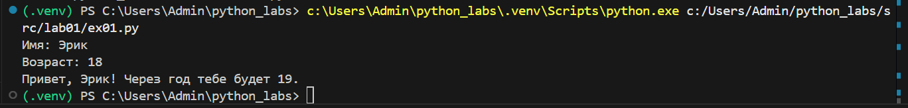
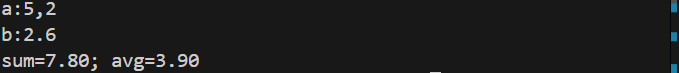
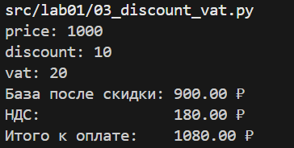
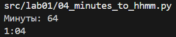
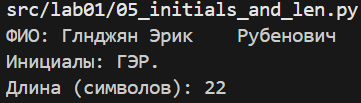
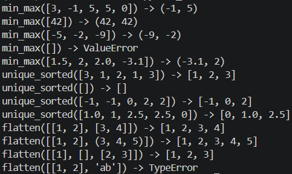
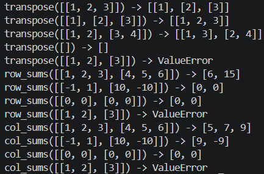
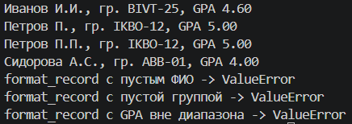

# Python Labs

Лабораторные работы по программированию. Каждая лаба — в своей папке `src/labXX`, скриншоты — в `images/labXX`.

## Лабораторная 1 — Ввод/вывод и форматирование

### Задание 1 — Привет и возраст

### Задание 2 — Сумма и среднее

### Задание 3 — Чек: скидка и НДС

### Задание 4 — Минуты → ЧЧ:ММ

### Задание 5 — Инициалы и длина строки

## Лабораторная 2 — Коллекции и матрицы

### Задание 1 — Массивы (arrays.py)

### Задание B — Матрицы (matrix.py)

### Задание C — Кортежи (tuples.py)
